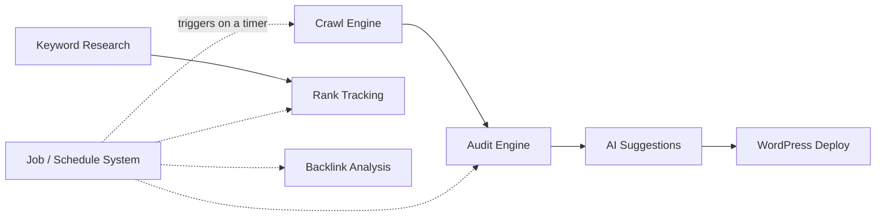
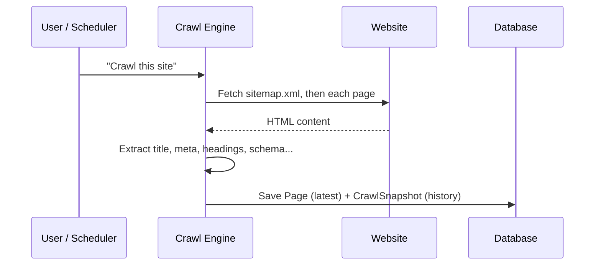
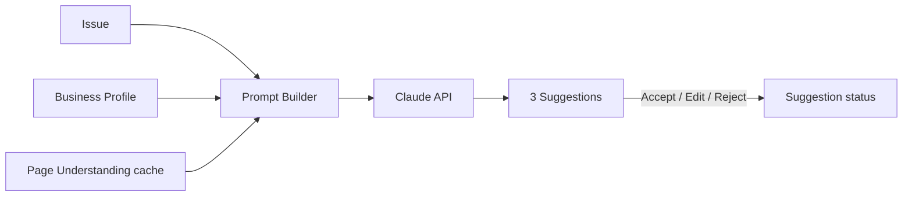
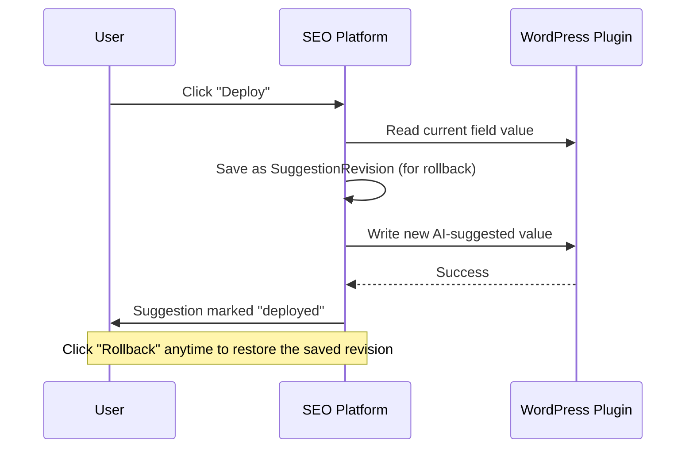
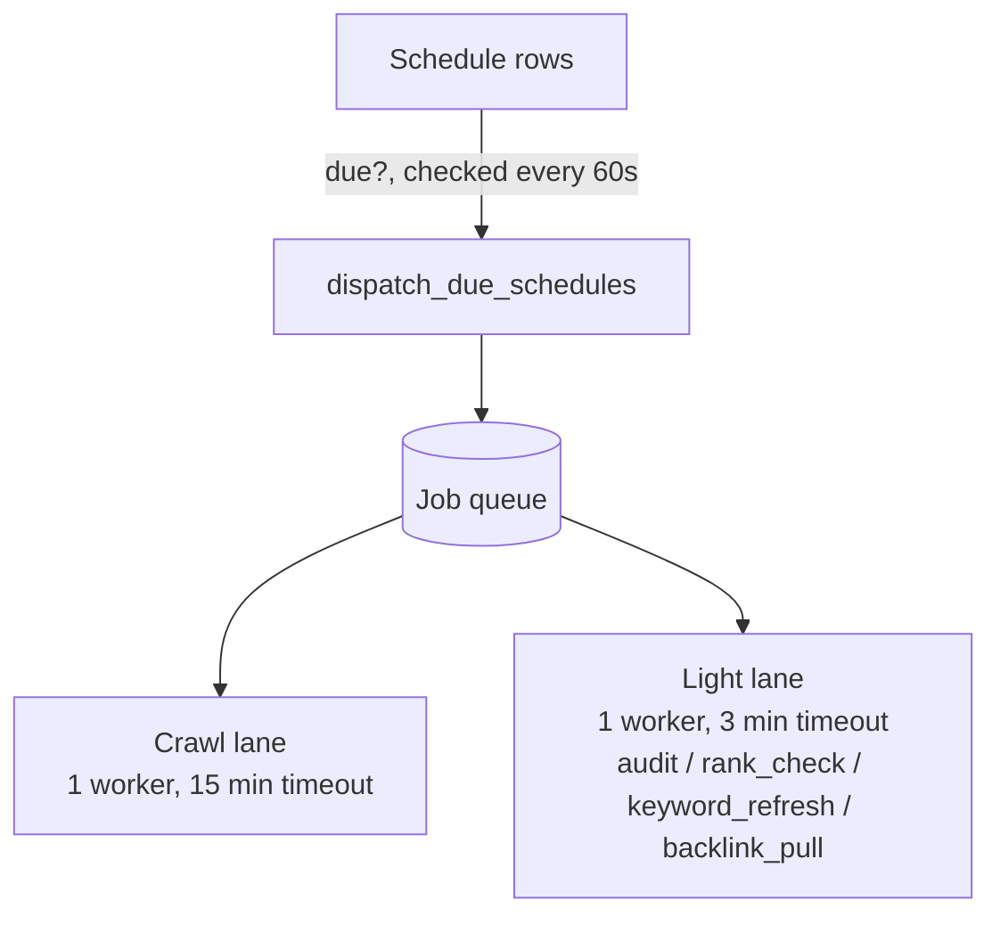
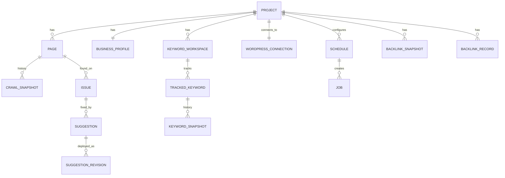

# How It Works — Tool-by-Tool Guide

A plain-language explanation of every tool in the platform, how they connect,
and what happens behind the scenes when you click a button. Written for
non-engineers — no code-reading required.

## The big picture

The platform manages one or more **Projects** (client websites). For each
project it repeats a loop: **crawl the site → find problems → suggest AI
fixes → (optionally) publish the fix to WordPress → track whether rankings
and backlinks improve.** A background scheduler can run every step
automatically on a timer, or you can trigger any step manually with a
button.

---

## 1. Crawl Engine

**What it does:** Visits your website like a browser would and reads every
page — title, meta description, headings, image alt text, structured data
(schema), social preview tags, canonical links. It first checks your
sitemap.xml to find pages; if that's missing, it follows internal links to
discover them itself.

**How you trigger it:** Click "Crawl Site" (whole site) or "Re-crawl" on a
single page. It also runs automatically on whatever schedule you set.

**What it saves:** The current snapshot of each page (`Page`), plus a full
history of every past crawl (`CrawlSnapshot`) so nothing is lost.

**What it talks to:** A local headless browser (Crawl4AI/Chromium) — no
external paid service, no data leaves your infrastructure for this step.

---

## 2. Audit Engine

**What it does:** Runs a checklist against every crawled page — missing or
duplicate titles, too-short meta descriptions, missing H1, missing image
alt text, missing schema, thin content — plus whole-site checks (SSL
certificate, security headers, robots.txt). Every finding becomes an
**Issue**, and each page gets a 0–100 health score.

**How you trigger it:** Click "Audit Site" or "Re-audit," or let the
scheduler run it automatically after each crawl.

**What it saves:** Replaces the project's issue list with fresh results
each time it runs (`Issue`).

**What it talks to:** Nothing external — pure rule-checking against data
already crawled, plus a live check of your SSL/security headers.

---

## 3. AI Suggestions

**What it does:** For any issue (e.g. "title too short"), asks Claude
(Anthropic's AI) to write 3 ready-to-use replacement options. It also
writes an optimized title+description pair and can draft a content brief.
To keep costs down and answers focused, it doesn't send Claude the whole
page every time — it uses a cached, distilled summary of the page plus the
relevant slice of your Business Profile (industry, audience, tone).

**How you trigger it:** Click "Generate AI Suggestion" on an issue. You
then Accept, Edit, or Reject each suggestion — decided suggestions are
never deleted, even if you regenerate more (they double as a learning
record of what worked).

**What it talks to:** The Anthropic Claude API.

---

## 4. Keyword Research

**What it does:** Look up search volume, difficulty, and search intent for
any keyword; get related/question/comparison keyword ideas; preview the
live Google results page (SERP); and see a single 0–10 **"Worth It" score**
that balances volume against difficulty, intent, and how cluttered the
results page is (ads, AI Overview, featured snippets eating your potential
click-through). Supports targeting specific countries.

**How you trigger it:** All from the Keyword Research workspace — search,
track a keyword, run bulk analysis, view SERP, generate a content brief.

**What it talks to:** Semrush and DataForSEO (it tries one, falls back to
the other if unavailable), plus Claude for brief generation.

---

## 5. Rank Tracking

**What it does:** For every keyword you're tracking, checks Google's
current results and records what position (if any) your site holds. This
is what turns "we picked a keyword" into "did it actually work."

**How you trigger it:** Scheduled only — turn on the "Rank Tracking"
toggle in a keyword workspace and it runs automatically on your chosen
interval. There's no manual "check now" button by design (rank position
doesn't change minute to minute).

**What it talks to:** DataForSEO (preferred — checks up to ~100 results)
or Semrush as a fallback (only checks the top 10, so a keyword ranking at
#15 would show as "not found" under fallback).

---

## 6. Backlink Analysis

**What it does:** Pulls your site's backlink profile (authority score,
number of referring domains, follow vs. nofollow counts) and its full list
of individual backlinks. Each pull is compared against the last one to
flag **new** links, links still active, and links that have **disappeared**
(lost).

**How you trigger it:** A manual refresh button, or automatically on
schedule.

**What it talks to:** Semrush (DataForSEO is not wired up for backlinks
yet).

---

## 7. WordPress Deploy

**What it does:** Once you've accepted an AI suggestion, this pushes it
live to your actual WordPress site — updating the SEO title/meta
description (via Yoast) or the page's H1. Before writing, it reads the
current value and saves it, so any deploy can be **rolled back** later
with one click.

**How you trigger it:** Connect your site once (URL + a security token
from the WordPress plugin), then click "Deploy" on any accepted
suggestion, and "Rollback" if you want to undo it.

**What it talks to:** A small companion WordPress plugin
(`claude-wp-mcp`) installed on your site, which exposes a secured API for
reading/writing specific fields — this platform never has raw database or
file access to your WordPress site, only what the plugin explicitly
allows.

---

## 8. Job / Schedule System — the automation backbone

**What it does:** This is what lets everything above run "on its own"
without you clicking anything. You set a **Schedule** per project per tool
(e.g. "crawl weekly," "check rankings daily"). Every 60 seconds, the system
checks for schedules that are due and creates a **Job**. Two independent
work queues then pick up due jobs and run them:

- **Crawl lane** — handles crawl jobs only (these are slow, up to 15 min).
- **Light lane** — handles audit, rank-check, keyword-refresh, and
  backlink-pull jobs (fast, capped at 3 min).

Splitting them into two lanes means one slow crawl can never block a quick
rank check from running on time — an actual bug that was found and fixed
(previously everything shared one lane and a single crawl could starve
everything else for minutes).

---

## 9. The data model, in plain terms

Everything above reads and writes to a shared set of tables. Here's how
they relate:

| Table | Plain-English meaning |
|---|---|
| Project | A client website being managed |
| BusinessProfile | The client's context (industry, audience, tone) fed to the AI |
| Page | The latest known state of one crawled URL |
| CrawlSnapshot | A historical copy of a page's crawl result |
| Issue | One audit finding on a page |
| Suggestion | An AI-written fix, with accept/edit/deploy status |
| SuggestionRevision | The before-value saved so a deploy can be rolled back |
| KeywordWorkspace | A keyword-research project space |
| TrackedKeyword | A keyword being actively monitored |
| KeywordSnapshot | A point-in-time volume/difficulty/position reading |
| SavedKeyword | A keyword bookmarked but not necessarily tracked |
| BacklinkSnapshot | Aggregate backlink stats at one point in time |
| BacklinkRecord | One individual backlink, with first/last-seen dates |
| WordPressConnection | Saved site URL + encrypted access token |
| Job | One background task instance (queued/running/done) |
| Schedule | Recurring-run configuration per project per tool |
| PageUnderstanding | Cached AI summary of a page, used to build cheaper prompts |

---

## External services relied on

| Service | Used for |
|---|---|
| Anthropic Claude API | AI suggestions, content briefs |
| DataForSEO | Keyword data, SERP checks, rank tracking (preferred) |
| Semrush | Keyword data, SERP checks (fallback), backlinks |
| `claude-wp-mcp` WordPress plugin | Reading/writing SEO fields on the client's WordPress site |
| Crawl4AI (local, headless Chromium) | Crawling — runs locally, not a paid API |

See `docs/dataforseo-account-blocker.md` for a known issue where the
DataForSEO account is currently unverified, causing rank checks to
silently fall back to Semrush's smaller result set.
